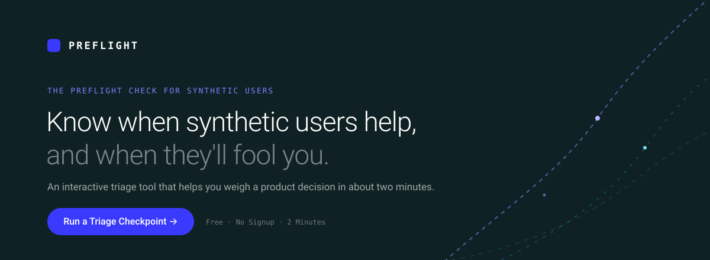

<p align="center">
  
</p>

<!-- Placeholder banner (docs/preview.svg). Replace with a real hero + Active Checkpoint screenshot or GIF when available. -->

# The Preflight Check for Synthetic Users

**Know when synthetic users help, and when they'll fool you.**

AI-driven product loops move too fast for traditional validation, creating a dangerous illusion of user certainty. **Preflight is an interactive triage tool that helps you weigh a product decision.** In about two minutes it tells you exactly where synthetic cohorts are highly reliable, and exactly when you must halt the loop and bring in real humans.

Built for product teams (PMs, designers, and researchers) making decisions about pricing, onboarding, and feature gates.

© 2026 Terry M. Patterson · Licensed under [Apache-2.0](LICENSE)

[](LICENSE)
[](https://openrouter.ai/)

---

## Two ways to run a decision through Preflight

Both paths share the same goal: knowing when to trust synthetic users. Pick the one that matches how your team builds.

### Building continuously with AI → the continuous-AI loop (primary)

If you go from intent to a working screen in hours, with no natural pause to validate, start with the **Active Checkpoint**. Run one decision through four gates and get an honest verdict:

1. **Triage** runs first and sets how hard the exit is. Low-stakes, reversible work gets a loose exit; high-stakes, irreversible work gets a hard one.
2. **Frame** runs a cheap synthetic gut-check that surfaces objections and edge cases. This is idea expansion, directional, not validation.
3. **Inspect** gives a directional read on what you've built so far, then you decide: refine, reframe, or proceed.
4. **Ship gate** hands you a ranked list of exactly what to validate with real humans before you ship, sized to a scarce budget.

Most runs end "go." The few that say "stop" are the ones that matter.

### Building in defined stages → the 8-gate framework (alternative)

If you work in phases (discovery, design, build, QA) with handoffs and reviews, use **The 8 Gate Preflight Framework** and the **Cohort Due Diligence** wizard. Walk a decision through eight sequential gates, from decision clarity and risk to grounding, calibration, and compliance, and get a clear proceed / adjust / stop verdict with a downloadable report.

---

## What It Does

Synthetic AI users can accelerate research, but misused they create feedback loops that distort product metrics, inflate conversion assumptions, and mislead entire roadmap cycles. Preflight exists to prevent that by telling you, per decision, where synthetic users are reliable enough to trust and where only real humans will do.

### Modules

| Module | What it does |
|---|---|
| **Active Checkpoint** | The continuous-AI loop triage. Run one decision through the Triage → Frame → Inspect → Ship gates for an honest go/stop verdict. **Start here.** |
| **The 8 Gate Preflight Framework** | Visual 8-step pipeline with a gate inspector; click any gate to see its operational guide and lifecycle rationale |
| **Cohort Due Diligence** | Step-by-step wizard that walks a decision through the eight gates and produces a proceed / adjust / stop verdict with a downloadable report |
| **Synthetic Persona Prompt Architect** | Generates a grounded, bias-resistant synthetic persona system prompt from real usage data, then lets you interview that persona live and audit for drift |
| **Usability Tester** | Directional, AI-assisted interface evaluation from a synthetic persona's perspective, with screenshot/image analysis |
| **Lifecycle Rationale** | Strategic matrix showing where synthetic users are and aren't appropriate across standard and agentic product lifecycles |

Take the built-in **90-second interactive tour** (first-visit chip, or the Menu) to see the whole loop in motion.

---

## Architecture

Preflight is a static front end (a single, self-contained `index.html` plus a few supporting pages) with **no database, no accounts, and no cloud storage**. The only server-side component is a **lightweight, stateless serverless function** (`api/ai.js`) that proxies AI requests to OpenRouter so the API key stays off the client; it stores no prompt content. All other computation (triage scoring, gate logic, persona and prompt assembly, report generation) runs in your browser.

---

## Usage

**No build step. No `npm install`.**

### Open locally

```bash
git clone https://github.com/vivistar/synth.git
cd synth
open index.html
```

The interface loads with no server. AI features need a key: either supply your own OpenRouter key in the app, or run behind the serverless proxy (below).

### Host it

Deploy `index.html`, `api/ai.js`, and the supporting pages (`landing.html`, `terms.html`, `privacy.html`, `trust.html`, `references.html`) to a host that runs the serverless function (e.g. Vercel).

Set the `OPENROUTER_API_KEY` environment variable so the app uses the server-side proxy with no key required from the user.

---

## API Key & Admin Gate

- **Shared key:** set `OPENROUTER_API_KEY` in your deployment's environment variables. The key is used server-side by `api/ai.js` and never reaches the browser.
- **Bring your own key:** any user can paste their own OpenRouter key into the in-app key popover; those requests go directly from their browser to OpenRouter and bypass the proxy. The key is held only in browser memory.
- **Admin unlock (optional):** set `ADMIN_UNLOCK` to a secret code and the wired `OPENROUTER_API_KEY` will be used **only** when a request presents a matching admin unlock code (entered once in the app). This reserves your key for yourself while everyone else brings their own. Leave `ADMIN_UNLOCK` unset to keep the shared key open to all.

See the [Trust Center](trust.html) for full key security guidance.

---

## Fork it

Preflight is open source under Apache-2.0. If you're building your own synthetic users, **fork it, adapt the gates and prompts to your own stack, and self-host.** Attribution requirements are satisfied by retaining the copyright notice, the `NOTICE` file, and a link back to this repository.

---

## License & Attribution

Copyright 2026 Terry M. Patterson

Licensed under the **Apache License, Version 2.0**. See the [LICENSE](LICENSE) file for the full text, or visit https://www.apache.org/licenses/LICENSE-2.0.

Maintained by Terry M. Patterson ([@vivistar](https://github.com/vivistar))

---

## Legal & Trust

| Document | Purpose |
|---|---|
| [Terms of Service](terms.html) | Permitted/prohibited use, AI disclaimer, liability |
| [Privacy Policy](privacy.html) | No-collection posture, OpenRouter data flow, GDPR/CCPA |
| [Trust Center](trust.html) | Architecture, AI transparency, compliance posture, vulnerability disclosure |
| [References](references.html) | Literature basis for the framework |
