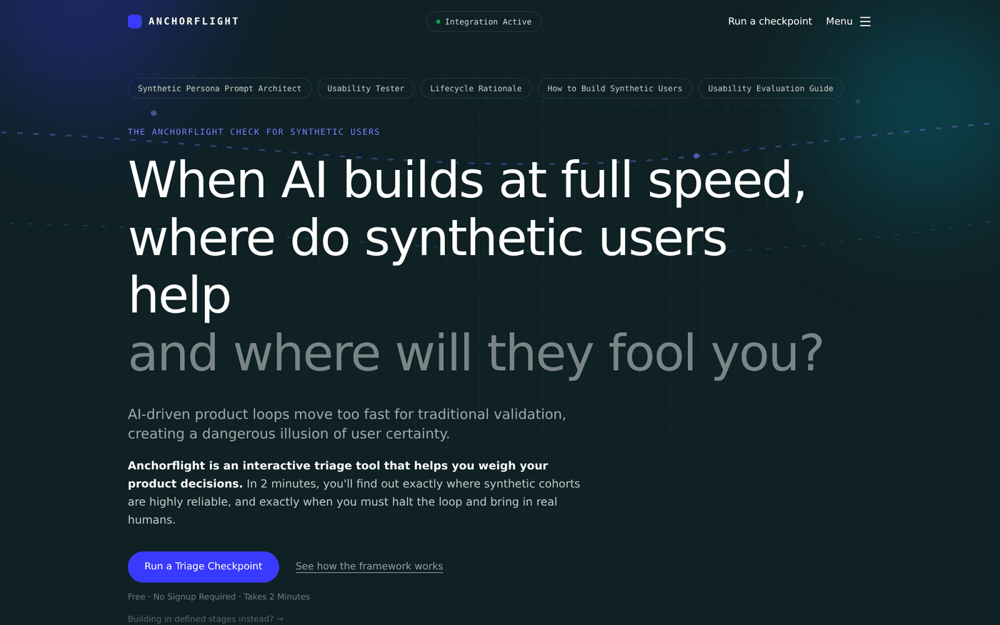
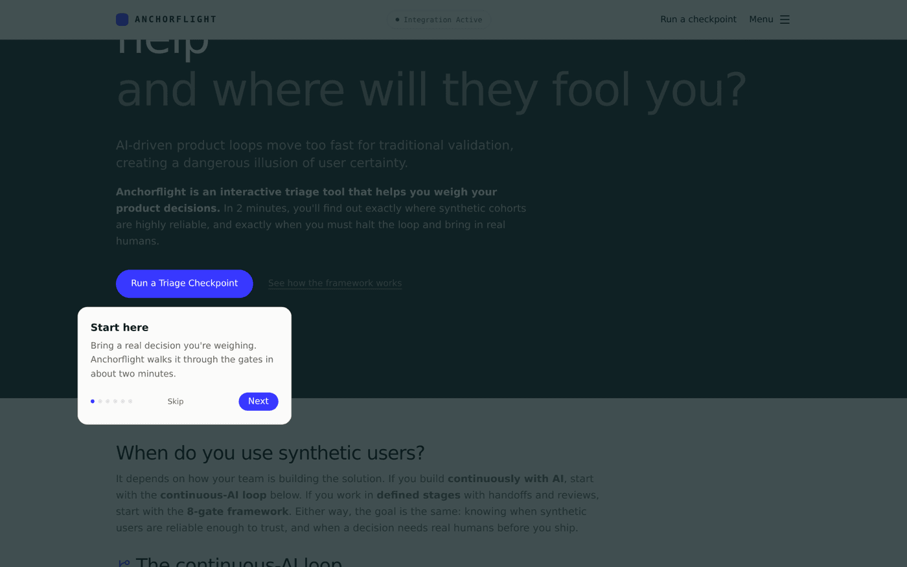
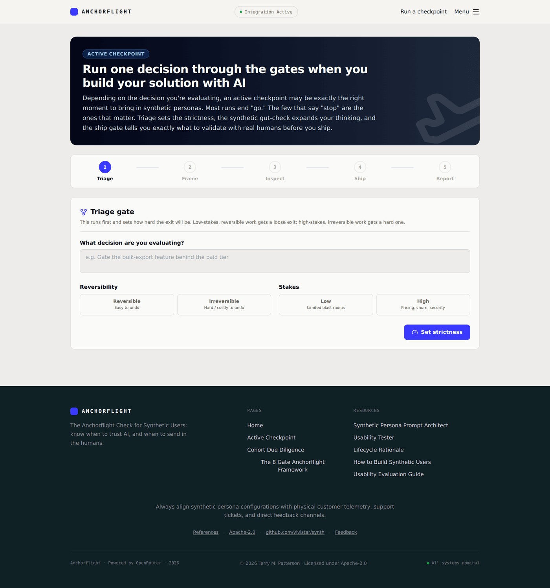
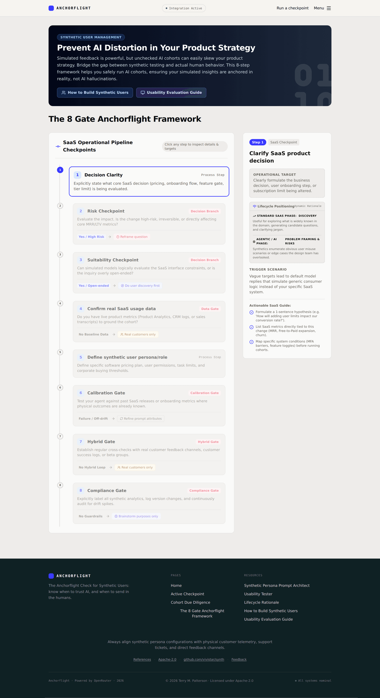
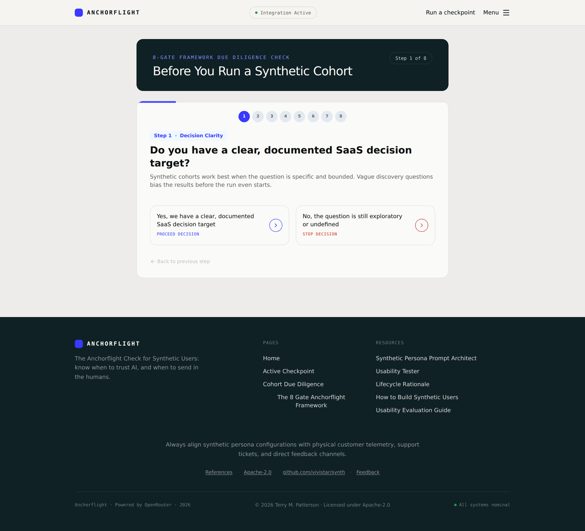
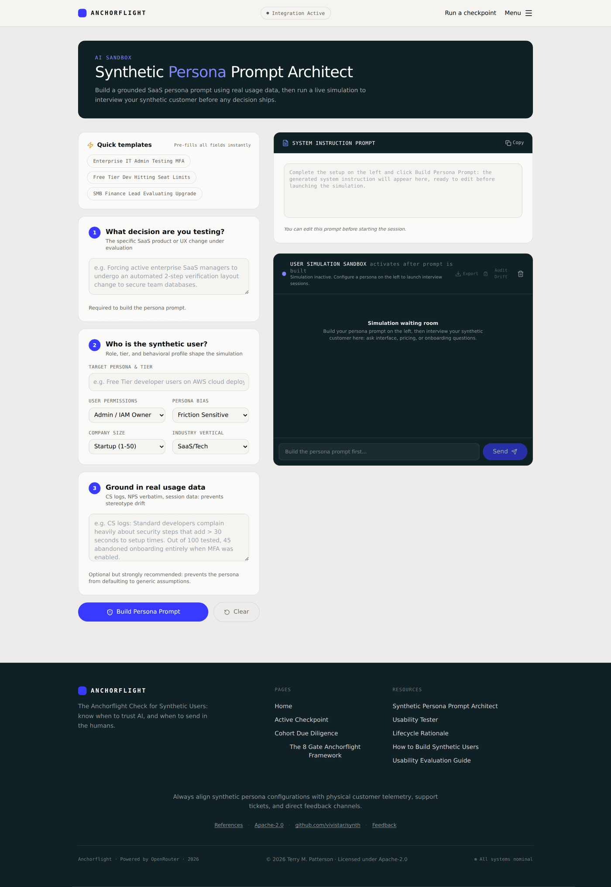
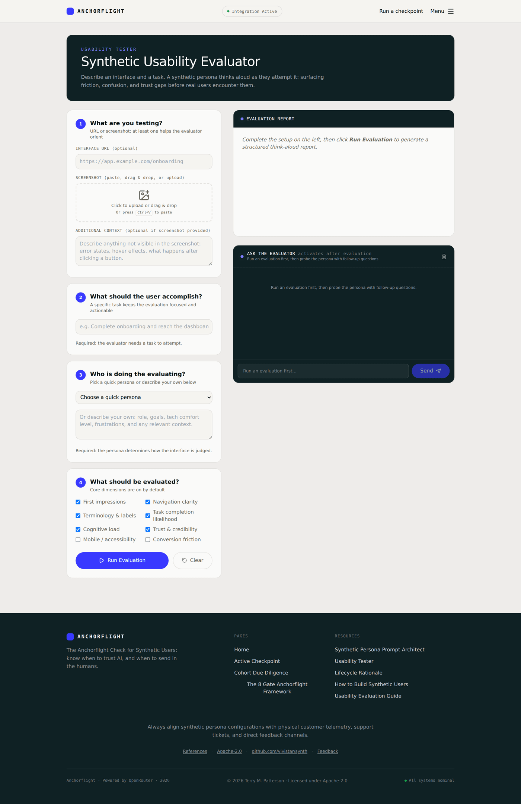
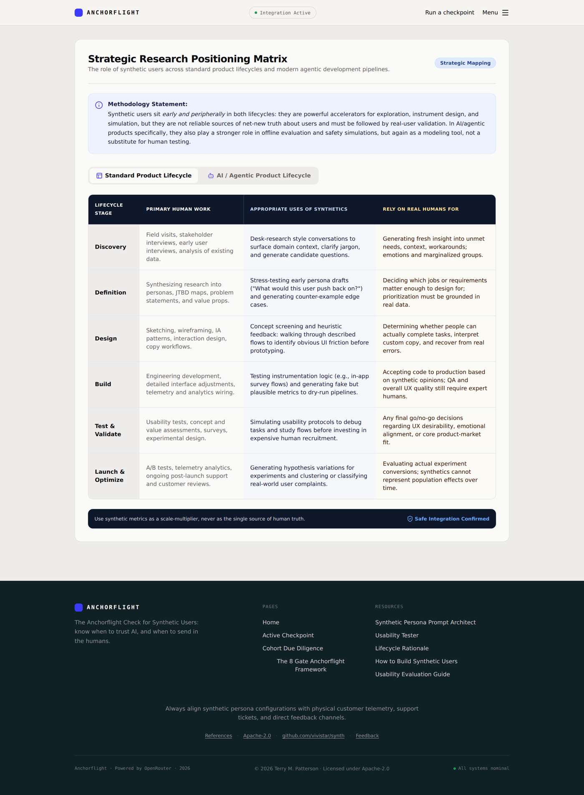
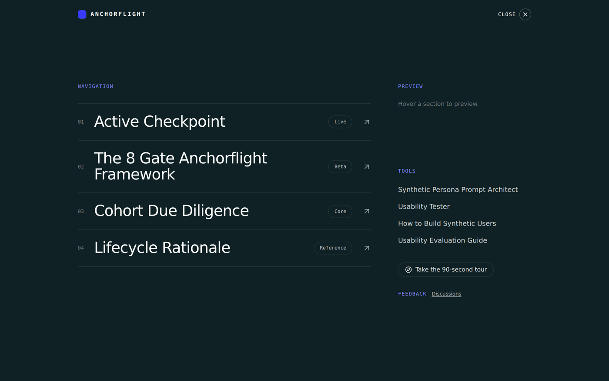

# Anchorflight — User Guide

**Know when synthetic users help, and when they'll fool you.**

Anchorflight is an interactive triage tool that helps you weigh a product decision. In about two minutes it tells you exactly where synthetic cohorts are highly reliable, and exactly when you must halt the loop and bring in real humans.

There is nothing to install and no account to create. Open the app and go.

---

## 1. Getting started

The home page opens with the hero and the primary action.

- **Run a Triage Checkpoint** is the one action to start with. It walks a single decision through the continuous-AI loop.
- **See how the framework works** scrolls to the loop diagram for the conceptual overview.
- Building in defined stages instead? The small link under the buttons takes you to the staged 8-gate framework.

There are **two ways to run a decision**, and both reach the same goal:

| If your team builds… | Start with | What it is |
|---|---|---|
| **Continuously with AI** (idea to working screen in hours) | **Active Checkpoint** | A fast triage loop: Triage → Frame → Inspect → Ship |
| **In defined stages** (discovery, design, build, QA) | **The 8 Gate Anchorflight Framework** + **Cohort Due Diligence** wizard | Eight sequential gates with a proceed / adjust / stop verdict |

---

## 2. Take the 90-second tour

New here? A spotlight tour walks you through the whole loop. It appears as a chip on your first visit, and is always available from the **Menu**.

Use **Next / Back**, the arrow keys, or **Esc** to exit. It drives the real interface so you see each tool in context.

---

## 3. Primary path — the Active Checkpoint

Click **Run a Triage Checkpoint**. You run one decision through five stages, shown in the stepper.

1. **Triage** runs first. Name the decision, then pick its **reversibility** and **stakes**. Triage sets how hard the exit is: low-stakes and reversible gets a loose exit; high-stakes and irreversible gets a hard one. Click **Set strictness** to continue.
2. **Frame** runs a cheap synthetic gut-check that surfaces objections and edge cases. This is idea expansion, directional, not validation.
3. **Inspect** gives a directional read on what you've built so far. You then decide: **refine**, **reframe**, or **proceed**.
4. **Ship gate** hands you a ranked list of exactly what to validate with real humans before you ship, sized to a scarce budget.
5. **Report** summarizes the run, which you can download.

> Most runs end "go." The few that say "stop" are the ones that matter.

---

## 4. Alternative path — the 8-Gate Framework

If you work in defined stages, open **The 8 Gate Anchorflight Framework**. It's a visual pipeline; click any gate to inspect its operational guide, trigger scenarios, and lifecycle rationale.

To walk a decision through the gates interactively, use the **Cohort Due Diligence** wizard. Each gate is a yes/no decision that routes you forward or to a safer path, ending in a proceed / adjust / stop verdict with a downloadable report.

---

## 5. The tools

### Synthetic Persona Prompt Architect

Build a grounded, bias-resistant synthetic persona from real usage data (role, tier, company size, industry, and baseline logs). Anchorflight generates the system prompt, then you can interview the persona live and audit the conversation for calibration drift.

### Usability Tester

Get directional feedback on an interface. Provide a URL or screenshot and a task, pick a persona, choose the evaluation dimensions, and a synthetic persona thinks aloud as it attempts the task, surfacing friction before real users hit it.

### Lifecycle Rationale

A strategic matrix showing where synthetic users genuinely help, and where you must rely on real humans, across the standard product lifecycle and the AI/agentic lifecycle.

---

## 6. Navigating

Everything is reachable from the **Menu** (top right). Hover a section to preview it.

---

## 7. AI keys

Anchorflight talks to language models through OpenRouter.

- **On a hosted deployment**, the operator can set a shared key (`OPENROUTER_API_KEY`) so no key is required from you.
- **Bring your own key**: open the "Integration Active" pill (top center) and paste your own OpenRouter key. It is held only in your browser and sent directly to OpenRouter.
- If AI features report that a key is required, add your own key in that popover.

See the [Trust Center](../trust.html) for full key-security details.

---

## 8. Building your own synthetic users?

Anchorflight is open source under Apache-2.0. Fork it, adapt the gates and prompts to your own stack, and self-host: [github.com/vivistar/synth](https://github.com/vivistar/synth).

---

*Screenshots are captured from the app; fonts may render slightly differently than the live site.*
